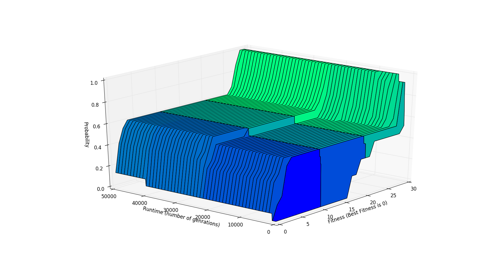

# MasterMind GA
Build a genetic algorithm to learn the MasterCode of the mastermind game.

## How to use?

This relies on the [DEAP framework](https://deap.readthedocs.io/en/master/). Start by pip installing it first or getting it from [https://github.com/deap/deap](https://github.com/deap/deap).

Playing with it is straightorward and modifying should also be easy after having a look at the DEAP documentation.


```
usage: mastermind-ga.py [-h] -n nb_slots -k nb_colors -l lambda -m mu [--mll]
                        [--max-gen Tmax] [--mutpb mutation_pb]
                        [--xpb crossover_pb] [--selection {comma,plus}]
                        [--var-ps {fp,random,elitist}] [--op-mutpb ind_mutpb]
                        [--op-xpb ind_xpb]
                        [--op-cx {uniform,blend,one-point,two-point}]
                        [--fp-selection] [--log {record,save}]
                        [--show-progress {true,false}]

Build your Genetic Algorithm to solve the Mastermind game.

optional arguments:
  -h, --help            show this help message and exit
  -n nb_slots           Size of the Mastermind game (number of holes/slots).
  -k nb_colors          Number of colors in the Mastermind game.
  -l lambda             Number of offsprings of a given population in the
                        (m[+/,]lambda)-GA.
  -m mu                 Size of intitial and post-selection populations in the
                        (m[+/,]lambda)-GA.
  --mll                 (mu+(lambda, lambda))-Genetic Algorithm.
  --max-gen Tmax        Stop algorithm after Tmax generations.
  --mutpb mutation_pb   Probability that an offspring color sequence is a
                        result of mutation.
  --xpb crossover_pb    Probability that an offspring color sequence is a
                        result of a crossover.
  --selection {comma,plus}
                        Selection strategy: "comma" for (mu,lambda)-GA and
                        "plus" for (mu+lambda)-GA
  --var-ps {fp,random,elitist}
                        Parent selection strategy in the variation phase:
                        random, elitist or fitness proportional
  --op-mutpb ind_mutpb  Independent probability for a color to be mutated. Use
                        "fp" for fitness proportional probability.
  --op-xpb ind_xpb      Independent probability for a color to be changed in a
                        Uniform abd Blend crossover.
  --op-cx {uniform,blend,one-point,two-point}
                        Crossover operator. Default is Unifrm crossover.
  --fp-selection        Selection strategy: either elitist or fitness
                        proportional.
  --log {record,save}   Enable stastics recording. Stored in a DEAP logbook.
                        Record then inspect using your favorite interactive
                        interpreter, otherwise use "save" to write the logs
                        into a pickled file.
  --show-progress {true,false}
                        Display progress bar. This requires tqdm to be
                        installed.
```

### Best performing combination:
```
$ python mastermind-ga.py -n $nb_slots -k $nb_colors -m μ -l λ --mll --op-mutpb=fp --var-ps=fp --max-gen=$MAX-GEN
```
## Plots:

A couple of helper scripts should help anyone get started with using saved logs to visualize some statistics.

[This script](helper_plot_scripts/3d_proba_plot.py) is used to plot the following 3D surface.


### How to use the scripts:
A slight modification to the code could be required, then run:
```
$ python helper_script.py saved-record1 [saved-record2 ...]
```

